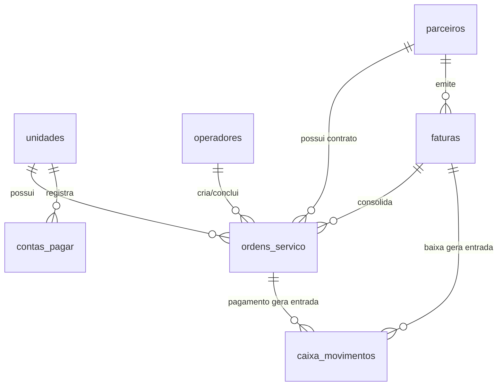

# Documentação Completa do Sistema — Certive Vistorias

Esta documentação descreve todos os aspectos de design, arquitetura de dados, funcionalidades e regras de negócio do sistema de gestão da **Certive Vistorias**.

---

## 1. Design System & Identidade Visual

O sistema foi desenvolvido seguindo uma estética **Premium, Sóbria e Institucional**, visando transmitir credibilidade, solidez e modernidade aos operadores e clientes.

### 1.1. Paleta de Cores
A paleta de cores utiliza contrastes refinados em HSL e variáveis CSS customizadas no arquivo [styles.css](file:///C:/Users/Ricardo/Desktop/CERTIVE%20PRINCIPAL/styles.css):

*   **Azul-Marinho Profundo (Deep Navy - Base)**: Usado para o fundo de menus laterais (`aside.sidebar`) e cabeçalhos principais, reforçando a identidade corporativa.
    *   `--bg-sidebar`: `#0a1128` (Navy Blue escuro)
    *   `--bg-primary`: `#0f172a` (Slate escuro para modo escuro geral)
*   **Realce Metálico Dourado/Bronze (Gold/Bronze Accent)**: Utilizado em elementos de foco, botões de ação principal, marcações ativas e detalhes finos.
    *   `--accent`: `#d4af37` (Dourado metálico)
    *   `--accent-light`: `#f3e5ab` (Dourado suave/creme)
*   **Cores de Status (Feedback Semântico)**:
    *   `--success`: `#10b981` (Verde esmeralda para concluídos/pagos)
    *   `--danger`: `#ef4444` (Vermelho para cancelados/reprovados/saídas)
    *   `--warning`: `#f59e0b` (Laranja/Amarelo para pendentes/alertas)
    *   `--info`: `#3b82f6` (Azul para informações do sistema)
*   **Cores Neutras (Texto e Bordas)**:
    *   `--text-primary`: `#f8fafc` (Branco gelo para máxima legibilidade)
    *   `--text-secondary`: `#94a3b8` (Cinza ardósia para rótulos e subtextos)
    *   `--border`: `#1e293b` (Cinza escuro para divisórias discretas)

### 1.2. Tipografia
*   **Fonte Principal (UI & Formulários)**: A fonte do sistema é **'Outfit'** (importada do Google Fonts), uma tipografia geométrica sans-serif moderna, limpa e de excelente legibilidade em telas de alta densidade.
*   **Títulos de Relatório & Cabeçalhos de Impressão**: Utiliza uma combinação elegante de fontes serifadas (Georgia/serif) e sans-serif pesada nos títulos das faturas e contratos impressos para dar um aspecto formal de cartório/órgão de trânsito.

### 1.3. Grid, Layout & UI/UX
*   **Glassmorphism**: Aplicação de efeitos de desfoque de fundo (`backdrop-filter: blur()`) e transparências sutis em painéis de cartões (`.panel-card`) e modais para criar profundidade visual.
*   **Responsividade**: Layout baseado em Flexbox e CSS Grid de colunas adaptáveis, redimensionando de forma fluida desde monitores ultrawide até tablets.
*   **Micro-animações**: Efeitos de transição (`transition: all 0.3s ease`) em todos os botões, opções de menu lateral e seletores de serviços ao passar o mouse (hover) e ao clicar (active).
*   **Caixa Alta Global (CapsLock Forçado)**: Ouvinte de eventos global em inputs de texto (`input[type="text"]`, `input[type="search"]`) e campos de observação (`textarea`), que converte automaticamente toda a digitação em caixa alta (maiúsculas) sem interferir na seleção do cursor, com exceção exclusiva dos campos de senhas (`input[type="password"]`).

---

## 2. Banco de Dados Local (LocalStorage Schema)

O sistema opera de forma autônoma sem dependência de banco de dados externo (servidor), gravando todas as tabelas em um objeto centralizado na chave `certive_db` do `localStorage` do navegador.

### 2.1. Tabelas e Atributos

#### 1. `db.unidades` (Filiais da Empresa)
*   `id` (int): Chave primária.
*   `nome` (string): Razão Social / Identificação da filial.
*   `endereco` (string): Endereço físico completo.

#### 2. `db.servicos` (Catálogo de Vistorias)
*   `id` (int): Chave primária.
*   `categoria` (string): Grupo do serviço ("Transferência", "Cautelar", "Pesquisa", "Exótico").
*   `nome` (string): Descrição comercial do serviço.
*   `porte` (string): Porte do veículo ("Pequeno", "Médio", "Grande", "N/A").
*   `precoBalcao` (decimal): Preço padrão de tabela para clientes particulares.

#### 3. `db.taxas_referencia` (Custos Variáveis por Vistoria)
*   `servicoId` (int): Chave estrangeira ligando a `db.servicos`.
*   `tax` (decimal): Custo unitário de concessão pago a terceiros (ex: DETRAN-SC).

#### 4. `db.operadores` (Usuários e Controle de Acesso)
*   `id` (int): Chave primária.
*   `nome` (string): Nome completo do funcionário.
*   `login` (string): Usuário de acesso ao sistema (case-insensitive).
*   `senha` (string): Senha em texto simples.
*   `funcao` (string): Cargo ("Gerente Geral", "Atendente", "Analista Financeiro", etc.).
*   `unidadeId` (int): Unidade padrão de alocação.
*   `permissoes` (array de strings): Lista de módulos liberados. Opções:
    *   `abertura_os` (Atendimento)
    *   `caixa` (Caixa Diário e Histórico Geral)
    *   `faturamento` (Faturamento Corporativo)
    *   `contas` (Financeiro / Contas a Pagar)
    *   `cadastros` (Configuração / Tabelas de Preços)
    *   `bi` (Acesso a relatórios de gestão do Painel BI)
*   `ativo` (boolean): Controle de inativação de conta.

#### 5. `db.parceiros` (Clientes Corporativos Conveniados)
*   `id` (int): Chave primária.
*   `nome` (string): Nome Fantasia do Parceiro.
*   `cnpj` (string): CPF ou CNPJ formatado.
*   `responsavel` (string): Nome completo do gestor responsável pela parceria.
*   `telefone` (string): Telefone de contato comercial.
*   `usaFaturamento` (boolean): `true` se puder acumular OSs para cobrança mensal; `false` se paga cada serviço à vista no balcão.
*   `observacoes` (string): Notas comerciais adicionais (telefones de gerentes comerciais/financeiros, acordos específicos).
*   `tabelaPrecos` (object): Mapeamento de preços especiais acordados. Estrutura: `{ servicoId: valorCustomizado }`. *(Exclui o serviço ID 6).*

#### 6. `db.ordens_servico` (Fichas e Atendimentos)
*   `id` (int): Chave primária.
*   `numero` (string): Identificador visível formatado (ex: "OS-0024").
*   `criadoEm` (string ISO): Data/Hora de abertura da O.S.
*   `criadoPor` (string): Nome do operador que realizou a abertura.
*   `unidadeId` (int): Unidade onde o serviço foi aberto.
*   `clienteTipo` (string): `"particular"` ou `"parceiro"`.
*   `parceiroId` (int/null): Referência ao parceiro associado se `clienteTipo` for `"parceiro"`.
*   `clienteNome` (string): Nome do solicitante / condutor do veículo.
*   `clienteCpfCnpj` (string): CPF/CNPJ do solicitante.
*   `clienteCelular` (string): Celular formatado.
*   `placa` (string): Placa do veículo (formato Mercosul ou antigo com máscara).
*   `renavam` (string): Código Renavam com 11 dígitos.
*   `servicoId` (int): Serviço contratado.
*   `servicoNome` (string): Nome completo do serviço na abertura.
*   `valor` (decimal): Preço final cobrado na O.S.
*   `observacoes` (string): Modelo, Ano e Cor do veículo vistoriado (Obrigatório).
*   `pago` (boolean): Estado financeiro de quitação.
*   `formaPagamento` (string): `"pix"`, `"debito"`, `"credito"`, `"credito_parcelado"`, `"especie"`, `"faturamento"` ou `"isento"`.
*   `parcelas` (int/null): Número de parcelas se a forma de pagamento for `"credito_parcelado"`.
*   `statusNfse` (string): Status da NFS-e ("Não solicitada", "Pendente de emissão", "Emitida").
*   `numeroNfse` (string/null): Número da NFS-e gerada na simulação.
*   `dataNfse` (string/null): Data de emissão da NFS-e.
*   `detranRegistrado` (boolean): Indica se a O.S. foi devidamente registrada no DETRAN-SC.
*   `docVeiculoApresentado` (boolean): Validação obrigatória da CRLV física/digital.
*   `docIdentificacaoApresentado` (boolean): Validação da CNH/RG física/digital do condutor.
*   `status` (string): Estado operacional da O.S. Opções:
    *   `aberta` (Aguardando pagamento/liberação)
    *   `paga` (Liberada para vistoriador de pátio)
    *   `em_execucao` (Veículo em vistoria física)
    *   `concluida_aprovada` (Vistoria concluída com parecer Aprovado)
    *   `concluida_reprovada` (Vistoria concluída com parecer Reprovado)
    *   `cancelada` (Ordem excluída/estornada)
*   `finalizadoEm` (string ISO/null): Data/Hora de emissão do laudo.
*   `finalizadoPor` (string/null): Nome do operador/vistoriador que laudou o veículo.
*   `canceladoEm` (string ISO/null): Data/Hora do estorno.
*   `canceladoPor` (string/null): Nome de quem realizou o cancelamento.
*   `reapresentacaoOrigemID` (int/null): ID da OS reprovada de origem caso seja um reteste gratuito.
*   `respostaDetranNet` (string/null): Resposta ao checklist obrigatório de encerramento ("SIM"/"NAO").
*   `respostaShopping` (string/null): Resposta ao checklist obrigatório de encerramento ("SIM"/"NAO").

#### 7. `db.caixa_diario` (Controle Diário de Caixa)
*   `id` (int): Chave primária.
*   `unidadeId` (int): Unidade associada a este caixa.
*   `data` (string formatada): Data de referência (ex: "2026-06-16").
*   `status` (string): `"aberto"` ou `"fechado"`.
*   `abertoPor` (string): Nome do operador que realizou a abertura do dia.
*   `fechadoPor` (string/null): Nome de quem realizou o fechamento da gaveta.
*   `fechadoEm` (string ISO/null): Data/Hora do encerramento.
*   `saldoAbertura` (decimal): Fundo inicial de troco (padrão de R$ 200,00).
*   `saldoEspécieInformado` (decimal): Valor físico em cédulas e moedas contado e informado pelo operador no fechamento.
*   `pdfConsolidado` (string base64/null): Relatório de caixa e PDF do portal do DETRAN mesclados.

#### 8. `db.caixa_movimentos` (Transações de Fluxo de Caixa)
*   `id` (int): Chave primária.
*   `caixaId` (int): Chave estrangeira ligando a `db.caixa_diario`.
*   `tipo` (string): `"entrada"` (crédito) ou `"saida"` (débito/sangria).
*   `valor` (decimal): Valor do lançamento.
*   `descricao` (string): Histórico ou finalidade do movimento.
*   `formaPagamento` (string): `"pix"`, `"debito"`, `"credito"`, `"credito_parcelado"` ou `"especie"`.
*   `data` (string ISO): Instante de lançamento.
*   `operador` (string): Operador responsável pelo lançamento.
*   `osId` (int/null): ID da O.S. de origem caso seja um recebimento integrado.
*   `faturaId` (int/null): ID da fatura de origem caso seja uma baixa em lote de parceiro.

#### 9. `db.contas_pagar` (Despesas Financeiras da Unidade)
*   `id` (int): Chave primária.
*   `unidadeId` (int): Unidade de custo associada.
*   `descricao` (string): Nome da conta ou descrição detalhada do custo.
*   `tipo` (string): `"fixo"` (luz, aluguel, internet) ou `"variavel"` (taxas mensais DETRAN).
*   `categoria` (string): Categoria da despesa ("Aluguel", "Água / Luz / Internet", "Impostos / Taxas", "Material de Escritório", "Serviços de Terceiros", "Outros").
*   `fornecedor` (string): Fornecedor da despesa.
*   `vencimento` (string formatada): Data de vencimento (ex: "2026-06-28").
*   `valor` (decimal): Valor total do boleto/guia.
*   `observacoes` (string): Campo de anotações contendo o Código de Barras da fatura.
*   `anexo` (string base64/null): Dados da fatura digitalizada (JPEG/PDF).
*   `comprovante` (string base64/null): Comprovante de pagamento anexado na liquidação (JPEG/PDF).
*   `pago` (boolean): Estado de liquidação da despesa.
*   `pagoEm` (string formatada/null): Data da liquidação.

#### 10. `db.faturas` (Invoices Corporativas Mensais)
*   `id` (int): Chave primária.
*   `codigo` (string): Código formatado visível (ex: "FAT-0004").
*   `parceiroId` (int): Cliente conveniado faturado.
*   `unidadeId` (int): Unidade emissora do faturamento.
*   `periodoInicio` (string formatada): Data inicial do lote faturado.
*   `periodoFim` (string formatada): Data final do lote faturado.
*   `valorTotal` (decimal): Soma dos valores das O.S.s agregadas.
*   `ordensIds` (array de ints): Lista dos IDs de O.S.s inclusas nesta fatura.
*   `statusBoleto` (string): Status do boleto bancário ("Não gerado", "Gerado", "Pago", "Vencido").
*   `boletoVencimento` (string/null): Vencimento do boleto bancário.
*   `boletoCodigoDeBarras` (string/null): Código de barras / linha digitável do boleto.
*   `pago` (boolean): Indica se a fatura foi quitada.
*   `pagoEm` (string ISO/null): Data/Hora da quitação em lote.
*   `criadoEm` (string ISO): Data de emissão.
*   `criadoPor` (string): Nome do analista financeiro que fechou a fatura.

#### 11. `db.auditoria` (Trilha de Logs Gerenciais)
*   `id` (int): Chave primária.
*   `operador` (string): Nome de quem realizou a ação.
*   `data` (string ISO): Data/Hora exata do evento.
*   `acao` (string): Categoria da operação ("Abertura OS", "Login", "Fechamento Caixa", "Laudo Emissão", etc.).
*   `descricao` (string): Detalhamento textual do log (ex: "Abriu a ordem OS-0005 para placa REPRO99").
*   `unidadeId` (int): Unidade de registro do log.

#### 12. `db.metas_despesas` (Metas Financeiras por Categoria)
*   `unidadeId` (object): Mapeia as metas de gastos mensais por categoria na filial. Formato: `{ unidadeId: { categoriaName: valorLimite } }`.

---

## 3. Módulos do Sistema e Funcionalidades

O sistema é dividido em **7 módulos operacionais** acessados via menu lateral responsivo:

### 3.1. Atendimento & Abertura de OS
Módulo focado na recepção do cliente e entrada de veículos.
*   **Seleção de Cliente**: Alterna entre Particular (tabela balcão editável) e Parceiro de Negócios ( dropdown de parceiros conveniados, puxando preços bloqueados do contrato e liberando opção de "Faturamento Mensal").
*   **Regra Especial "Carros exóticos"**: Ao selecionar este serviço específico (ID 6), o campo de valor do serviço é limpo e habilitado para edição manual de preço por parte do operador, desativando travas contratuais de parceiros ou balcão.
*   **Observações Obrigatórias do Veículo**: O atendente deve obrigatoriamente preencher o Modelo, Ano e Cor do veículo no campo dedicado (`os-obs`) para registrar a O.S.
*   **Validação Documental**: Bloqueio de abertura caso os checks de verificação física do CRLV e identificação oficial do solicitante não estejam marcados.
*   **Impressão Automática de Contrato**: Logo após salvar a O.S., a tela de impressão do navegador é chamada exibindo o contrato preenchido e formatado sob as normas legais vigentes, contendo os termos de vistoria, dados do veículo com observações e linhas de assinatura.
*   **Busca Rápida de Serviços**: Barra de busca dinâmica em pátio que permite pesquisar vistorias registradas hoje ou em qualquer período pelo número de O.S., placa do veículo ou nome do cliente.

### 3.2. Caixa Diário
Módulo financeiro do caixa da filial no dia a dia.
*   **Controle de Abertura/Fechamento**: Exige a abertura diária do caixa com saldo padrão de troco de R$ 200,00. Nenhuma O.S. à vista ou lançamento manual pode ser feito com o caixa do dia fechado.
*   **Lançamentos Manuais**: Permite realizar movimentações financeiras diretas no caixa para sangria (saída de dinheiro para pagamento de despesas de limpeza, lanches rápidos, café) ou aportes/entradas manuais.
*   **Fechamento Conciliado**: No final do expediente, o operador conta as cédulas/moedas em espécie da gaveta e informa o saldo físico. O sistema calcula o saldo esperado (saldo inicial + entradas em espécie - saídas em espécie) e calcula a diferença de caixa (sobra ou quebra).
*   **Relatório de Caixa PDF**: Função de exportação para folha A4 contendo o fechamento consolidado. Divide-se em 3 seções claras: demonstrativo analítico de entradas (com placa, hora, descrição e observações dos veículos), saídas manuais e resumo consolidado dividindo o montante apurado por modalidade (Pix, Espécie, Débito, Crédito, Faturamento).

### 3.3. Histórico Geral
Módulo gerencial completo para auditoria e controle de todas as O.S.s emitidas na filial.
*   **Filtros Combinados**: Sistema de filtragem multicritério avançado por Placa, Solicitante (Nome/CPF/CNPJ), Tipo de Serviço, Valor exato do serviço, Período de Data Inicial/Final, Forma de Pagamento e Status do Laudo (aberta, concluída aprovada, concluída reprovada, cancelada).
*   **Ficha Detalhada (Modal OS)**: Exibe a ficha operacional completa de cada serviço, incluindo a linha do tempo do fluxo (quem criou, hora do pagamento, hora da entrada no pátio e emissão de laudo).
*   **Edição de O.S. aberta**: Permite alterar dados de cliente, veículo, serviço contratado, valor e forma de pagamento se a O.S. ainda estiver em status `"aberta"` (pendente de pagamento).
*   **Cancelamento de O.S.**: Permite cancelar uma O.S. aberta. Se a ordem estiver paga em dinheiro, o sistema gera automaticamente uma saída de estorno de caixa no caixa do dia atualizado.
*   **Exclusão de O.S.**: Botão restrito para remover permanentemente a O.S. de status aberta da base local, disparando registro imediato na auditoria interna de dados.

### 3.4. Faturamento
Gestão de contas corporativas faturadas a prazo.
*   **Vistorias Pendentes (Loteamento)**: Tabela exibindo todas as O.S.s de parceiros cujo pagamento foi selecionado como "Faturamento Mensal" e que já foram aprovadas em pátio. O operador pode filtrar por parceiro, selecionar as O.S.s correspondentes e fechar um lote de faturamento.
*   **Emissão de Fatura**: Cria um registro de fatura unificado com código sequencial (ex: "FAT-0005"), gerando um período de cobrança de datas do lote.
*   **Demonstrativo de Cobrança (Impressão de Fatura)**: Layout de fatura para impressão contendo os dados do tomador e do prestador, sumário do período, valor consolidado, lista detalhada de cada serviço executado (exibindo número da O.S., placa e modelo/ano/cor do veículo) e termo de aceite.
*   **Baixa e Liquidação**: Permite registrar o pagamento de faturas emitidas. A liquidação exige que o caixa do dia atual da filial esteja aberto, injetando o valor total recebido como uma entrada Pix no fluxo diário do caixa automaticamente.

### 3.5. Contas a Pagar
Controle de despesas da unidade operacional.
*   **Despesas Fixas**: Cadastro manual de faturas comerciais como aluguel, energia elétrica, telefonia, internet, com data de vencimento e valor.
*   **Código de Barras com Cópia Rápida**: Campo de observações para digitação do código de barras do boleto. Na listagem, o operador pode clicar no ícone de cópia rápida para transferir o código diretamente para a área de transferência do computador, agilizando o pagamento no internet banking.
*   **Anexo de Fatura (Upload de até 1MB)**: Permite anexar a fatura em PDF ou JPEG. O arquivo é validado em tamanho (teto de 1MB) e gravado em Base64 na base de dados.
*   **Pré-visualização Interna**: Ao clicar no ícone do olho na tabela de contas, abre-se uma pré-visualização nativa em tela cheia do arquivo anexado (usando visualizador de imagem ou visualizador de PDF embedado no modal), com um botão de atalho para baixar o arquivo no computador do usuário.
*   **Consolidação de Custos DETRAN**: Ferramenta que lê todas as vistorias concluídas no mês e unidade de análise e aplica as taxas unitárias de concessão cadastradas (ex: R$ 27,00 para transferência). Ao clicar em Consolidar, o sistema calcula o valor total devido ao órgão regulador e gera uma conta a pagar consolidada de tipo "Variável" na tabela financeira.

### 3.6. Painel BI (Business Intelligence)
Módulo gráfico com indicadores de performance em tempo real da empresa.
*   **Indicadores Rápidos (KPIs)**: Exibição de faturamento consolidado por regime de competência, custos operacionais totais (soma de despesas fixas + estimativa de taxas variáveis do DETRAN), estimativa de lucro líquido real e ticket médio obtido por vistoria executada.
*   **Gráficos Vetoriais Dinâmicos (CSS/SVG)**:
    *   *Faturamento Semanal*: Comparativo em barras verticais do total recebido por semana no mês de análise.
    *   *Representação do Faturamento*: Barra de progresso horizontal mostrando a divisão em porcentagem de vendas para Particulares (balcão) vs Parceiros Corporativos conveniados.
    *   *Ranking de Serviços*: Lista ordenada com barras de progresso exibindo os tipos de serviços de vistorias mais solicitados no período.
    *   *Top 5 Parceiros*: Tabela dinâmica listando os 5 parceiros corporativos que mais geraram receita para a unidade, indicando a quantidade de O.S.s fechadas e o ticket médio de cada parceiro.

### 3.7. Configurações
Área de controle do administrador do sistema.
*   **Tabela de Balcão**: Permite redefinir os valores cobrados de clientes particulares para cada um dos serviços catalogados.
*   **Taxas de Referência**: Permite ajustar os valores de custo de concessão por vistoria praticados por órgãos públicos reguladores.
*   **Parceiros**: Tela de cadastro, edição de dados e reajuste individual de tabela acordada com as empresas parceiras (excluindo o serviço ID 6). Permite controle de CNPJ/CPF combinados, responsável e anotações.
*   **Operadores & Unidades**: Painel de cadastramento de usuários operacionais do sistema com configuração granular de permissões e designação de filiais. Cadastro de novas filiais e unidades operacionais.
*   **Trilha de Auditoria**: Exibição em tempo real da lista histórica dos logs operacionais gravados pelas ações de operadores no sistema.

---

## 4. Regras de Negócio Críticas do Sistema

Para garantir a segurança dos dados e o correto funcionamento do fluxo financeiro, o sistema implementa as seguintes regras operacionais:

### 4.1. Regra de Reapresentação Gratuita (Vistorias Reprovadas)
*   Se o veículo for reprovado em uma vistoria do tipo **"Transferência"**, o cliente possui o prazo legal de **30 dias corridos** (a contar da data de conclusão do laudo original) para se reapresentar para reteste sem custo.
*   Na tela de Atendimento, ao buscar a O.S. reprovada pela placa na barra de pesquisa e acessar os detalhes, o sistema exibirá um aviso amarelo com a contagem de dias restantes para expiração do prazo de gratuidade e habilitará o botão **"Reapresentar sem Custo"**.
*   Ao acionar a reapresentação, o formulário de abertura de O.S. é carregado copiando os dados cadastrais do veículo e solicitante da ordem anterior. O valor é fixado em **R$ 0,00**, a forma de pagamento é configurada como **"Isento"** e o campo de valor é bloqueado para edição.
*   A nova O.S. é vinculada gravando o ID da ordem reprovada no campo `reapresentacaoOrigemID`. A ordem de origem é atualizada salvando a data de reapresentação em `reapresentadaData`.
*   Se o prazo de 30 dias estiver estourado, o sistema exibe um aviso vermelho de prazo expirado e bloqueia a criação da ordem gratuita, forçando o atendente a abrir um serviço normal com cobrança integral de tabela.
*   Vistorias do tipo **"Cautelar"** ou **"Pesquisa"** reprovadas não possuem janela legal de reapresentação gratuita (reteste gratuito indisponível).

### 4.2. Travamento de Preços Contratuais com Parceiros
*   Clientes corporativos (Parceiros) possuem uma tabela de preços acordada em contrato e salva no seu cadastro (`tabelaPrecos`).
*   Ao abrir uma O.S. com a categoria "Parceiro de Negócios", o sistema lê a tabela de preços especiais e substitui o valor sugerido. O campo de valor final na tela de atendimento é **desabilitado/bloqueado** para digitação para evitar descontos não autorizados por atendentes de balcão.
*   **Exceção Exclusiva**: A regra de travamento de preço de parceiro não se aplica ao serviço especial **"Carros exóticos"** (ID 6). Quando este é selecionado, o campo de preço é limpo e liberado para digitação manual do valor negociado no balcão mesmo em atendimentos corporativos, permitindo a negociação individual com o cliente do parceiro.

### 4.3. Regras de Bloqueio Financeiro (Controle de Caixa)
*   **Caixa Diário Aberto Obrigatório**: Não é permitido registrar O.S.s quitadas imediatamente (Pix, Débito, Crédito, Dinheiro), lançar movimentações manuais ou dar baixa e liquidar faturas de parceiros se o caixa do dia atual da filial estiver fechado ou não inicializado.
*   **Estorno de O.S. Cancelada**: Ao cancelar uma O.S. que já tenha sido paga com a forma de pagamento "Dinheiro" (Espécie), o sistema gera automaticamente e de forma transparente um lançamento de saída (débito) de caixa com a descrição `"Estorno OS-XXXX (Venda Cancelada)"` na gaveta física correspondente, descontando o montante do saldo diário da filial.
